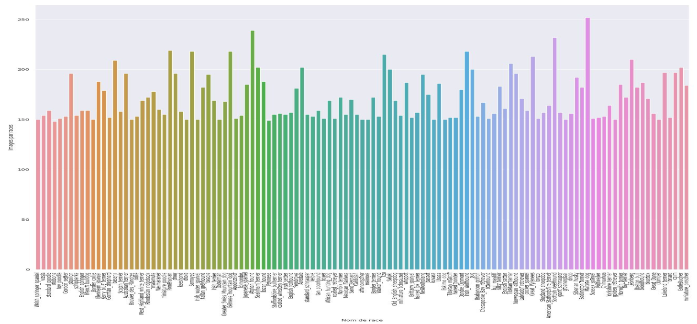
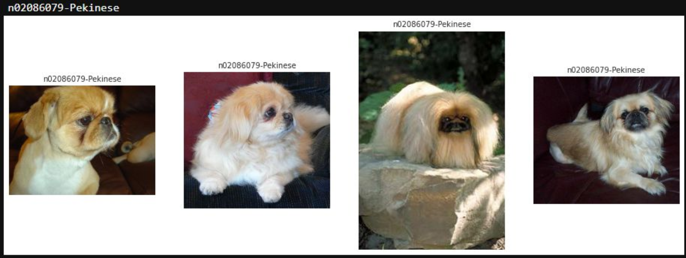
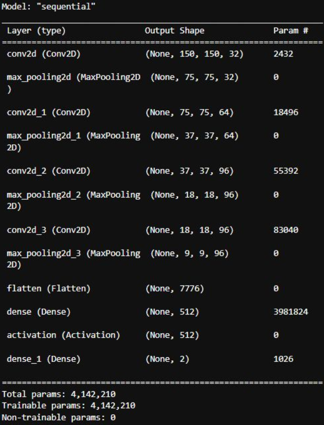
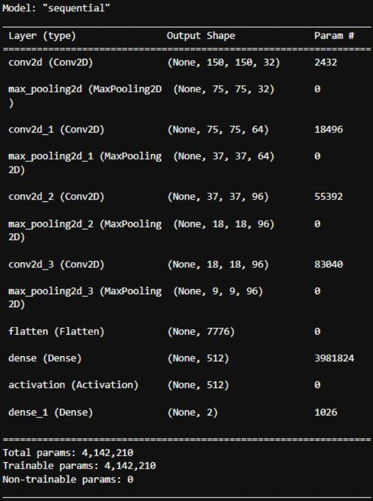
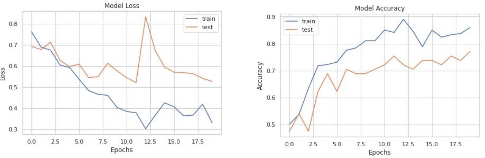

# Dog breed classification

## Presentation of the project :

### Objective:

Develop an algorithm capable of classifying according to the breed of dog in the image.

This objective can be likened to a task of supervised classification task.

### Data :
Use of data available on [Vision Stanford](http://vision.stanford.edu/aditya86/ImageNetDogs/). 

Comprising images of dogs classified by breed in different different folders.

There are 120 breeds represented with a total of 20 430 images.

Each folder corresponds to a particular breed of dog with a unique ID.

Number of images per dog breed :

Example of image :

Model from Scratch

CNN model : 

- Keras implementation

evaluation :

DenseNet121 :

evaluation :

